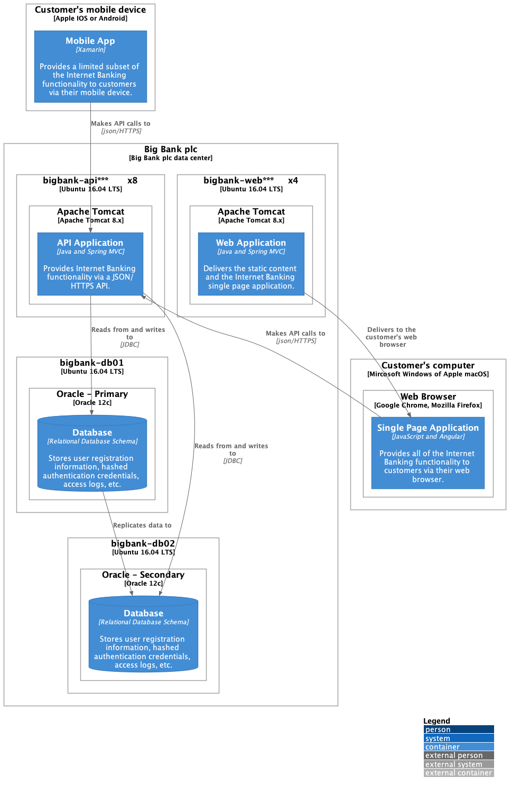

# 2 Deployment

* [Overview](/docs/README.md)
  * [1 Internet Banking System](/docs/1%20Internet%20Banking%20System/README.md)
    * [API Application](/docs/1%20Internet%20Banking%20System/API%20Application/README.md)
    * [Single Page Application](/docs/1%20Internet%20Banking%20System/Single%20Page%20Application/README.md)
      * [Dynamic Diagram](/docs/1%20Internet%20Banking%20System/Single%20Page%20Application/Dynamic%20Diagram/README.md)
      * [Extended Docs](/docs/1%20Internet%20Banking%20System/Single%20Page%20Application/Extended%20Docs/README.md)
  * [**2 Deployment**](/docs/2%20Deployment/README.md)
  * [3 BigBank](/docs/3%20BigBank/README.md)

---

**Deployment diagram**

A deployment diagram allows you to illustrate how containers in the static model are mapped to infrastructure. This deployment diagram is based upon a UML deployment diagram, although simplified slightly to show the mapping between containers and deployment nodes. A deployment node is something like physical infrastructure (e.g. a physical server or device), virtualised infrastructure (e.g. IaaS, PaaS, a virtual machine), containerised infrastructure (e.g. a Docker container), an execution environment (e.g. a database server, Java EE web/application server, Microsoft IIS), etc. Deployment nodes can be nested.

**Scope**: A single software system.

**Primary elements**: Deployment nodes and containers within the software system in scope.

**Intended audience**: Technical people inside and outside of the software development team; including software architects, developers and operations/support staff.

